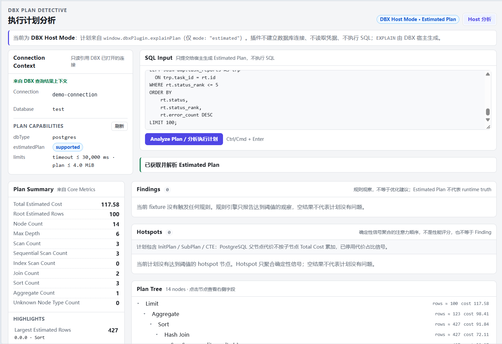
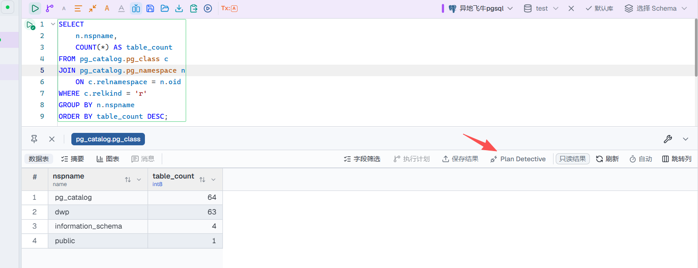

# DBX Plan Detective

DBX 的 SQL 执行计划分析插件。

基于数据库返回的 **Estimated Plan**，对执行计划进行结构化解析、热点定位和确定性诊断，帮助快速发现大表扫描、Nested Loop 放大、Sort 等值得关注的执行计划特征。它提供证据和检查方向，不把估算结果当作真实运行时事实，也不自动改写 SQL。

[](https://github.com/t8y2/dbx)
[](https://github.com/0verme/dbx-plugin-plan-detective/releases)
[](LICENSE)
[](https://www.postgresql.org/)
[](https://www.mysql.com/)
[](https://www.microsoft.com/sql-server)

## 插件简介

Plan Detective 从 DBX 当前已打开的数据库连接获取 Estimated Plan，然后把 Host 返回的原始计划交给分析流水线：

```text
DBX 当前连接
    → Host Estimated Plan
    → Raw Plan
    → Structured Parsing
    → Plan Tree / Metrics
    → Hotspots / Findings
```

PostgreSQL、MySQL 和 SQL Server 会进入结构化分析；其他已支持获取 Estimated Plan 的数据库仍可查看 Host 返回的 Raw Plan。

## 主界面



> Plan Detective 在 DBX Host Mode 下分析 Estimated Plan，展示 Plan Summary、Findings、Hotspots 与 Plan Tree。

## 主要功能

- **Estimated Plan 分析**：从 DBX 查询结果上下文或 Workbench 发起分析。
- **PostgreSQL 结构化解析**：将 JSON 执行计划整理为统一的计划树和指标。
- **MySQL JSON Explain 结构化解析**：支持 DBX Host 返回的 `EXPLAIN FORMAT=JSON`。
- **SQL Server ShowPlanXML 结构化解析**：支持 DBX Host 返回的 `format: "xml"` Estimated Plan，保留 ShowPlanXML 专有代价与对象信息。
- **Plan Tree 与 Plan Summary**：查看节点层级、估算行数、扫描 / Join / Sort 等基础指标。
- **Hotspots 热点定位**：用确定性、engine-aware 的信号提示优先检查的节点，不生成综合评分。
- **Hotspot 人话解释**：在保留原始 node label / statement / code / source / Evidence 的同时，按 `zh-CN` / `en` 输出自然语言摘要。
- **复制 AI 分析提示词**：把当前分析上下文（Database Context / SQL / Plan Summary / Findings / Hotspots / Evidence）在本地打包成结构化 Prompt，由用户自行粘贴到外部 AI 工具；插件不调用任何 AI 服务，也不自动发送任何内容。
- **Findings 确定性诊断**：针对已实现的规则提供 Finding、证据和检查方向。
- **中文 / English Finding 解释**：将结构化诊断事实按语言呈现。
- **Raw Plan 查看**：保留并展示 DBX Host 返回的原始执行计划。
- **查询结果上下文**：从 DBX 查询结果打开时自动带入 connection、database 和 SQL。

## 安装

当前版本已发布到 [GitHub Releases](https://github.com/0verme/dbx-plugin-plan-detective/releases)，但尚未进入 [DBX Store](https://github.com/t8y2/dbx-store) 官方目录；目前以 GitHub Release 的未签名候选包手动安装为主。

1. 从 [Releases](https://github.com/0verme/dbx-plugin-plan-detective/releases) 下载对应版本的 `.dbxp` 包，例如 `io.github.0verme.plan-detective-0.6.1-universal.dbxp`。
2. 打开 DBX → **插件中心** → **第三方与开发者选项**，开启「允许安装未签名开发包」。
3. 在插件中心选择并安装下载的 `.dbxp` 文件。

运行要求：DBX `>=0.6.18`，并需要支持 Host Plan API 1.2 的宿主。当前插件声明的权限为 `host.plans:read`。

## 使用方法

### 从 DBX 查询结果打开

执行 SQL 后，可直接从查询结果工具栏进入 Plan Detective。DBX 会带入当前 connection / database / SQL 上下文。



```text
执行 SQL
  → 打开查询结果
  → 选择 Plan Detective
  → 自动带入当前 connection / database / SQL
  → Analyze Plan
```

这是最直接的入口：插件复用当前查询结果的 DBX 上下文，通过 DBX Host Plan API 获取 Estimated Plan。

### 从 Workbench 打开

```text
打开 DBX Plan Detective Workbench
  → 指定一个已经在 DBX 中打开的连接
  → 输入 SQL
  → Analyze Plan
```

Plan Detective 不创建数据库连接，也不读取数据库凭据；Workbench 只引用 DBX 中已经打开的连接。

## Finding 示例

### Large Sequential Scan

**发现**：某个表的 Estimated Plan 显示预计需要扫描大量行。

**为什么值得关注**：大规模顺序扫描可能带来较高的 I/O 成本，值得结合查询条件和数据分布进一步检查。

**可以检查**：

- `WHERE` 条件是否有合适的索引可供优化器考虑；
- 查询是否读取了不必要的数据；
- optimizer statistics 是否仍然合理。

这是基于 Estimated Plan 的确定性规则提示，不等于已经确认存在性能故障；`severity` 表示规则的关注级别，不代表真实运行时严重度。加索引也不保证一定能解决该提示。

## 数据库支持

Plan Detective 通过 DBX Host Plan API 获取当前已打开连接的 Estimated Plan。支持状态分为结构化分析和 Raw Plan 展示：

| Database | Plan support |
| --- | --- |
| PostgreSQL | Structured |
| MySQL | Structured |
| SQL Server | Structured |
| Oracle | Raw Plan |
| OceanBase Oracle | Raw Plan |
| Doris | Raw Plan |
| Dameng | Raw Plan |
| QuestDB | Raw Plan |

`Structured` 表示 Plan Detective 会进一步解析为统一执行计划结构并进行 Metrics / Hotspot / Finding 分析；`Raw Plan` 表示当前仍可查看 Host 返回的原始执行计划，但尚未实现对应 structured parser。

## 安全边界

### 只分析 Estimated Plan

当前只分析 Estimated Plan：不使用 `EXPLAIN ANALYZE`，也不为了分析而真实执行用户 SQL。请求中的 `mode` 固定为 `estimated`，由 DBX Host 负责构造只读计划请求。

### 不直接管理数据库连接

DBX 负责 Connection、Credential、Driver 和 Plan Execution；Plan Detective 只消费 Host 返回的执行计划。插件不建立连接、不读取凭据，也不引入自己的数据库驱动。

### 当前不依赖 AI

当前 Finding 和 Hotspot 基于确定性规则，仓库中不依赖 LLM 或 AI SDK。这里描述的是当前实现边界，不预设未来不会增加其他辅助能力。

## 当前限制

- 当前只支持 Estimated Plan，不支持 Actual Plan 或 `EXPLAIN ANALYZE`。
- 当前只有 PostgreSQL、MySQL 和 SQL Server 提供 structured parser；其他数据库为 Raw Plan 展示，不生成对应的结构化 Metrics / Hotspots / Findings。
- 尚未实现 Plan Diff、Plan History、AI SQL Rewrite 或自动调优。
- Estimated Plan 反映的是优化器估算；Finding / Hotspot 是值得检查的规则提示，不是已确认的运行时性能故障。

## 工作原理

```text
DBX Connection
    → Host Estimated Plan
    → Parser
    → Normalized Plan
    → Metrics / Hotspots / Findings
    → Plan Tree / Raw Plan / UI
```

完整的 Host 边界、parser registry、NormalizedPlan、Metrics、Rules、Findings、Hotspots 和 fixture 约定见：

- [架构与职责边界](docs/ARCHITECTURE.md)
- [Plan Core 输入、parser 与 fixture 契约](docs/PLAN_INPUT_AND_FIXTURES.md)
- [项目计划与 Future 边界](docs/PROJECT_PLAN.md)

## 开发

需要 Node.js 22+：

```bash
npm install
npm test
npm run build
dbx-plugin dev --path . --port 5190
dbx-plugin package .
```

`ui/` 是必须入库的发布产物：官方 release workflow 直接打包它，不会替你重新构建。`dist/` 是本地生成的候选包目录，不入库。

## 项目结构

```text
assets/          插件图标等静态资源
src/             Svelte 前端与 Plan Core 源码
ui/              已构建、需要入库的 DBX UI 发布产物
docs/            架构、契约、计划与截图资源
fixtures/        离线执行计划样本
manifest.json    DBX 插件清单
```

## 文档

- [STATUS.md](STATUS.md)：当前版本、验证记录与已知事项。
- [docs/ARCHITECTURE.md](docs/ARCHITECTURE.md)：架构边界、Host API 职责与数据链路。
- [docs/PLAN_INPUT_AND_FIXTURES.md](docs/PLAN_INPUT_AND_FIXTURES.md)：RawPlanInput、parser、NormalizedPlan、Metrics、Rules、Findings、Hotspots 与 fixture 约定。
- [docs/PROJECT_PLAN.md](docs/PROJECT_PLAN.md)：已确认决策、阶段划分与 Future 能力边界。
- [docs/HOST_CAPABILITY_AUDIT.md](docs/HOST_CAPABILITY_AUDIT.md)：历史 Host 能力审计记录。
- [DBX 插件开发指南](https://dbxio.com/en/docs/plugin-development)。

## License

[Apache-2.0](LICENSE)
