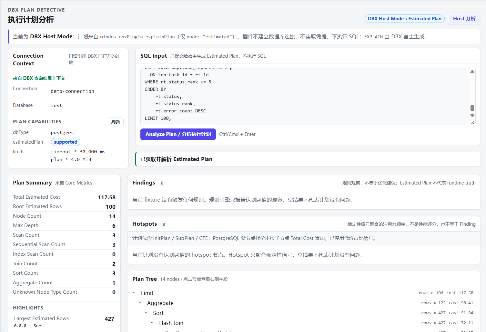
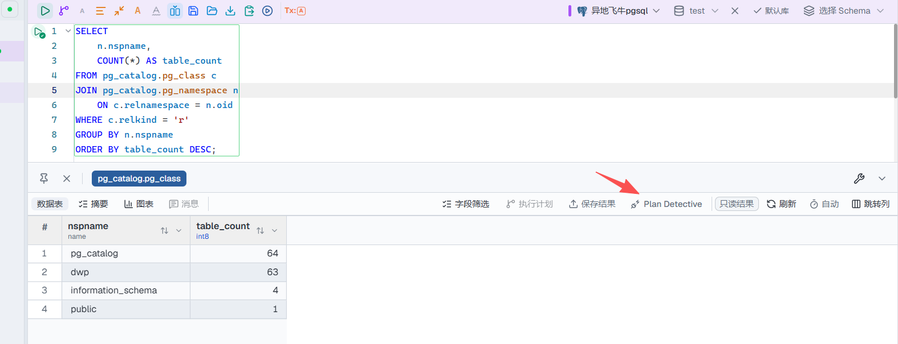

# DBX Plan Detective

DBX 的 SQL 执行计划分析插件。

解析 SQL 预估执行计划（Estimated Plan），可视化执行过程，帮助定位潜在的性能瓶颈和异常节点。分析结果基于优化器估算，不代表 SQL 的实际运行表现；它提供排查线索，不会自动修改 SQL。

[](https://github.com/t8y2/dbx)
[](https://github.com/0verme/dbx-plugin-plan-detective/releases)
[](LICENSE)
[](https://www.postgresql.org/)
[](https://www.mysql.com/)
[](https://www.microsoft.com/sql-server)
[](https://www.oceanbase.com/)
[](https://www.oceanbase.com/)
[](https://www.oracle.com/database/)
[](https://www.dameng.com/)
[](https://questdb.com/)
[](https://doris.apache.org/)

## 插件简介

在 DBX 中，可以从查询结果或 Workbench 发起分析，并通过执行计划树查看各节点的层级关系。插件还会整理出值得进一步检查的诊断提示和热点节点：

```text
DBX 当前连接
    → Host Estimated Plan
    → Raw Plan
    → Structured Parsing
    → Plan Tree / Metrics
    → Hotspots / Findings
```

PostgreSQL、MySQL、SQL Server、OceanBase Oracle、OceanBase MySQL、Oracle、Dameng、QuestDB 和 Doris 会进入结构化分析。OceanBase MySQL 仅在 DBX `dbVersion` 明确包含 OceanBase 标识时与 Native MySQL 区分，并与 OceanBase Oracle 共享 OceanBase JSON plan pipeline。Doris 输出保留多个 Fragment-local operator tree 与仅用于 metadata 的跨 Fragment exchange link。

## 主界面



> Plan Detective 在 DBX 中展示预估执行计划树，以及相关诊断提示和热点节点，帮助用户判断后续检查方向。

## 主要功能

- **预估执行计划分析**：从 DBX 查询结果上下文或 Workbench 发起分析。
- **PostgreSQL 结构化解析**：将 JSON 执行计划整理为统一的计划树和指标。
- **MySQL JSON Explain 结构化解析**：支持 DBX Host 返回的 `EXPLAIN FORMAT=JSON`。
- **SQL Server ShowPlanXML 结构化解析**：支持 DBX Host 返回的 `format: "xml"` Estimated Plan，保留 ShowPlanXML 专有代价与对象信息。
- **OceanBase Oracle / MySQL JSON 结构化解析**：支持 DBX Host 返回的 `format: "json"` Estimated Plan（`EXPLAIN FORMAT=JSON`），按 `CHILD_<n>` 递归构建计划树，共享 OceanBase JSON parser / normalizer，并保留 `EST.TIME(us)` / `COST` 等 OceanBase 专有估算信息。OceanBase MySQL 根据 DBX `dbType=mysql` 与 `dbVersion` 中的 OceanBase 证据保守识别，不改变 Native MySQL `query_block` parser。
- **Oracle DBMS_XPLAN 文本结构化解析**：支持 DBX Host 当前生成的 `DBMS_XPLAN.DISPLAY(..., 'TYPICAL +PREDICATE')` Estimated Plan，按 Operation 缩进恢复树结构，保留 `Rows`、predicate marker / text 与 Oracle 原生估算字段。
- **Dameng Estimated Plan 文本结构化解析**：支持 DBX Host 返回的 Dameng 原生 `EXPLAIN` 文本，按缩进恢复树结构、按 operation id 关联 predicate，保留 `[cost, rows, bytes-per-row]` 与未知算子原文；仅支持 Estimated Plan。
- **QuestDB Estimated EXPLAIN 文本结构化解析**：按相对缩进恢复 operator tree，保留原始行、inline / standalone properties 与未知 operator；PageFrame / Row / Frame pipeline 只将 relation-access Frame / Interval 节点计作一次扫描。
- **Doris Estimated EXPLAIN text structured parser**：按 `Distributed Plan` → `PLAN FRAGMENT` → fragment-local operator tree 恢复结构；保留 Fragment / Sink / Exchange metadata、`cardinality → estimatedRows`、join / sort / aggregate normalization 与未知 operator / property。Sink → Exchange 跨 Fragment 关系只作为 metadata / evidence，不构造完整 DAG；generic structural wrapper 可 traversal，但不参与 operator metrics / rules / hotspots；Doris cost 不映射 PostgreSQL cost。
- **Plan Tree 与 Plan Summary**：查看节点层级、估算行数、扫描 / Join / Sort 等基础指标。
- **Hotspots 热点定位**：用确定性、engine-aware 的信号提示优先检查的节点，不生成综合评分。
- **Hotspot 人话解释**：在保留原始 node label / statement / code / source / Evidence 的同时，按 `zh-CN` / `en` 输出自然语言摘要。
- **复制 AI 分析提示词**：把当前分析上下文（Database Context / SQL / Plan Summary / Findings / Hotspots / Evidence）在本地打包成结构化 Prompt，由用户自行粘贴到外部 AI 工具；插件不调用任何 AI 服务，也不自动发送任何内容。
- **DBX Built-in AI Tool（0.7.0-rc.1）**：新增只读 `analyze_estimated_plan` sidecar tool，将已取得的完整 Estimated Plan 交给现有 Plan Core 做确定性分析；插件不获取计划、不执行 SQL、不连接数据库。当前 DBX 上游尚不支持把此类独立插件 tool 绑定到普通原生数据库连接，故真实 Agent 链路仍待上游能力与 Desktop runtime smoke 验证。
- **Findings 确定性诊断**：针对已实现的规则提供 Finding、证据和检查方向。
- **中文 / English Finding 解释**：将结构化诊断事实按语言呈现。
- **Raw Plan 查看**：保留并展示 DBX Host 返回的原始执行计划。
- **查询结果上下文**：从 DBX 查询结果打开时自动带入 connection、database 和 SQL。

## 安装

Plan Detective 已收录到 [DBX Store](https://github.com/t8y2/dbx-store) 官方目录，可在 DBX 插件中心搜索并安装。GitHub Releases 也提供未签名候选包，供需要手动安装的用户使用。

### 通过 DBX Store 安装

1. 打开 DBX → **插件中心**。
2. 搜索 `Plan Detective`，选择官方条目并安装。

### 从 GitHub Release 手动安装

1. 从 [Releases](https://github.com/0verme/dbx-plugin-plan-detective/releases) 下载 `.dbxp` 包，例如 `io.github.0verme.plan-detective-0.6.7-universal.dbxp`。
2. 打开 DBX → **插件中心** → **第三方与开发者选项**，开启「允许安装未签名开发包」。
3. 在插件中心选择并安装下载的 `.dbxp` 文件。

GitHub Release 提供的候选包未签名；通过 DBX Store 安装时不需要开启未签名开发包选项。

运行要求：DBX `>=0.6.23`、支持 Host API 1.2 的宿主及系统 Node.js 22+（用于 Node sidecar）。当前权限仍只有 `host.plans:read`；AI Tool 不读取业务数据，也不需要 `host.data:read`。当前 AI Tool 版本为 `0.7.0-rc.1`，尚未通过 DBX Desktop runtime smoke，不代表运行时已验证。

## 使用方法

### 从 DBX 查询结果打开

执行 SQL 后，可直接从查询结果工具栏进入 Plan Detective。DBX 会带入当前 connection / database / SQL 上下文。



```text
执行 SQL
  → 打开查询结果
  → 选择 Plan Detective
  → 自动带入当前 connection / database / SQL
  → Analyze Plan
```

这是最直接的入口：插件复用当前查询结果的 DBX 上下文，通过 DBX Host Plan API 获取 Estimated Plan。

### 从 Workbench 打开

```text
打开 DBX Plan Detective Workbench
  → 指定一个已经在 DBX 中打开的连接
  → 输入 SQL
  → Analyze Plan
```

Plan Detective 不创建数据库连接，也不读取数据库凭据；Workbench 只引用 DBX 中已经打开的连接。

### DBX 内置 Agent（0.7.0-rc.1）

`analyze_estimated_plan` 只接收已取得的完整 Estimated Plan raw JSON / text / XML，以及显式 `dbType`、`mode=estimated`、`format` 和完整性元数据；不接收 SQL 或 Markdown 表格代替 raw plan，也不会自行获取计划。当前 DBX Agent `explain_query` 没有可交接的 structured raw-plan contract，因此若无法独立获得完整原始计划与来源信息，**不要调用此工具**。

当前上游 DBX 只在 plugin-owned connection 上发现 / 执行 plugin tools；Agent 的 `explain_query` 只向模型提供 Markdown 表格文本，结构化 plan data 只供 UI 使用。因此本版本虽包含 sidecar 与工具 contract，**尚不能在普通 DBX 原生数据库连接上完成端到端 Agent 链路**，不得视为 runtime verified。完整审计、上游 capability gap 与 Desktop smoke checklist 见 [docs/AI_TOOL_V0.7.0.md](docs/AI_TOOL_V0.7.0.md)。

## Finding 示例

### Large Sequential Scan

**发现**：某个表的 Estimated Plan 显示预计需要扫描大量行。

**为什么值得关注**：大规模顺序扫描可能带来较高的 I/O 成本，值得结合查询条件和数据分布进一步检查。

**可以检查**：

- `WHERE` 条件是否有合适的索引可供优化器考虑；
- 查询是否读取了不必要的数据；
- optimizer statistics 是否仍然合理。

这是基于 Estimated Plan 的确定性规则提示，不等于已经确认存在性能故障；`severity` 表示规则的关注级别，不代表真实运行时严重度。加索引也不保证一定能解决该提示。

## 数据库支持

Plan Detective 通过 DBX Host Plan API 获取当前已打开连接的 Estimated Plan。支持状态分为结构化分析和 Raw Plan 展示：

| Database | Plan support |
| --- | --- |
| PostgreSQL | Structured |
| MySQL | Structured |
| SQL Server | Structured |
| OceanBase Oracle | Structured |
| OceanBase MySQL compatibility mode | Structured (shared OceanBase JSON pipeline; requires OceanBase version evidence) |
| Oracle | Structured |
| Dameng | Structured (Estimated only) |
| QuestDB | Structured (Estimated only) |
| Doris | Structured (Estimated only) |

`Structured` 表示 Plan Detective 会进一步解析为统一执行计划结构并进行 Metrics / Hotspot / Finding 分析。Oracle 仅声明支持 DBX 当前的 `TYPICAL +PREDICATE` 文本输出，不泛化到其他 DBMS_XPLAN display 格式；Dameng、QuestDB 与 Doris 仅支持 Estimated 原生文本，不支持 Actual / ANALYZE / PROFILE。

## 安全边界

### 只分析 Estimated Plan

当前只分析 Estimated Plan：不使用 `EXPLAIN ANALYZE`，也不为了分析而真实执行用户 SQL。请求中的 `mode` 固定为 `estimated`，由 DBX Host 负责构造只读计划请求。

### 不直接管理数据库连接

DBX 负责 Connection、Credential、Driver 和 Plan Execution；Plan Detective 只消费 Host 返回的执行计划。插件不建立连接、不读取凭据，也不引入自己的数据库驱动。

### AI Tool 只提供确定性证据

Plan Detective 不调用 LLM 或 AI SDK。`analyze_estimated_plan` 只接受已取得且完整的 Estimated Plan raw payload，复用同一套 Plan Core 和既有 AI context builder；它不会获取计划、执行 SQL、访问连接 lifecycle 或业务数据。当前 DBX Agent 尚不能把原生 `explain_query` 结果按该 contract 交接给插件。输出中的 Finding / Hotspot 是带 caveat 的确定性线索，不是实际运行性能证明；没有 Finding 不代表 SQL 没问题。

## 当前限制

- 当前只支持 Estimated Plan，不支持 Actual Plan 或 `EXPLAIN ANALYZE`。
- 当前 PostgreSQL、MySQL、SQL Server、OceanBase Oracle、OceanBase MySQL compatibility mode、Oracle、Dameng、QuestDB 和 Doris 提供 Estimated structured parser；OceanBase MySQL / Oracle 共享 JSON plan pipeline；Doris 的 Fragment wrappers 不计入 operator metrics，cost / width 不跨引擎推断。
- OceanBase Oracle / MySQL 的 `EST.TIME(us)` / `COST` 属于 OceanBase 自己的估算模型，不会映射成 PostgreSQL 语义的代价，也不参与代价类 Hotspot / Finding；OceanBase JSON 的 `format: "text"` 降级计划仍只展示 Raw Plan。
- Oracle parser 只接受 Estimated `DBMS_XPLAN.DISPLAY(..., 'TYPICAL +PREDICATE')`；Oracle `Cost` 只保留在 `engineSpecific.oracle`，不映射为共享 `startupCost` / `totalCost`，也不产生 PostgreSQL cost hotspot。
- Dameng parser 只接受 Estimated 原生文本；`[cost, rows, bytes-per-row]` 的 `cost` 只保留在 `engineSpecific.dameng`，不伪装为 PostgreSQL `startupCost` / `totalCost`，热点与规则只使用可靠的行数信号。
- QuestDB parser 只接受 Estimated `format: "text"`；计划未报告共享的 rows / PostgreSQL cost，相关字段保持 `null`，不据此生成性能信号；PageFrame / Row cursor 作为 pipeline 节点展示，不重复计算 relation scan。
- Doris parser 只接受 Estimated `format: "text"`；保留 Distributed Plan / PLAN FRAGMENT / fragment-local operator tree，Sink→Exchange link 只作为 metadata / evidence，不构造完整 DAG；generic structural wrapper 可 traversal，但不参与 operator metrics / rules / hotspots；`cardinality` 映射 `estimatedRows`，scan 使用中性 `scan`，Doris cost 与 `avgRowSize` 不映射 PostgreSQL cost / shared width。官方文档转录与 synthetic fixtures 不是真实 Doris capture。
- 尚未实现 Plan Diff、Plan History、AI SQL Rewrite 或自动调优。
- 当前 DBX 0.6.26 上游只从打开的 plugin-owned connection 发现 plugin tools；Plan Detective 没有数据库 connection provider，因而 `analyze_estimated_plan` 暂不能绑定普通 DBX 原生 Agent 连接。DBX `explain_query` 给模型的是 Markdown 表格文本，结构化 `explain_data` 只供 UI 使用；端到端交接需要上游提供普通 Agent connection tool binding 和可供后续 tool 消费的结构化 Estimated Plan 结果。插件不会用 Host API 重跑 EXPLAIN 绕过此限制。
- Estimated Plan 反映的是优化器估算；Finding / Hotspot 是值得检查的规则提示，不是已确认的运行时性能故障。

## 工作原理

```text
DBX Connection
    → Host Estimated Plan
    → Parser
    → Normalized Plan
    → Metrics / Hotspots / Findings
    → Plan Tree / Raw Plan / UI
```

完整的 Host 边界、parser registry、NormalizedPlan、Metrics、Rules、Findings、Hotspots 和 fixture 约定见：

- [架构与职责边界](docs/ARCHITECTURE.md)
- [Plan Core 输入、parser 与 fixture 契约](docs/PLAN_INPUT_AND_FIXTURES.md)
- [项目计划与 Future 边界](docs/PROJECT_PLAN.md)
- [v0.7.0 AI Tool 契约、上游 gap 与 Runtime gate](docs/AI_TOOL_V0.7.0.md)

## 开发

需要 Node.js 22+：

```bash
npm install
npm test
npm run build
dbx-plugin dev --path . --port 5190
npm run package
```

`npm run package` 会构建 UI 并调用自有 Node sidecar packager；DBX CLI package 当前只从 `[backend]` 编译 Rust/Go sidecar，不适用于本插件的 Node runtime。`ui/` 是必须入库的发布产物。`dist/` 是本地生成的候选包目录，不入库。

## 项目结构

```text
assets/          插件图标等静态资源
backend/         Node JSONL sidecar 与平台 launcher
src/             Svelte UI、AI Tool adapter、Plan Core 源码
ui/              已构建、需要入库的 DBX UI 发布产物
docs/            架构、契约、计划与截图资源
fixtures/        离线执行计划样本
manifest.json    DBX 插件清单
```

## 文档

- [STATUS.md](STATUS.md)：当前版本、验证记录与已知事项。
- [docs/ARCHITECTURE.md](docs/ARCHITECTURE.md)：架构边界、Host API 职责与数据链路。
- [docs/PLAN_INPUT_AND_FIXTURES.md](docs/PLAN_INPUT_AND_FIXTURES.md)：RawPlanInput、parser、NormalizedPlan、Metrics、Rules、Findings、Hotspots 与 fixture 约定。
- [docs/PROJECT_PLAN.md](docs/PROJECT_PLAN.md)：已确认决策、阶段划分与 Future 能力边界。
- [docs/HOST_CAPABILITY_AUDIT.md](docs/HOST_CAPABILITY_AUDIT.md)：历史 Host 能力审计记录。
- [DBX 插件开发指南](https://dbxio.com/en/docs/plugin-development)。

## License

[Apache-2.0](LICENSE)
